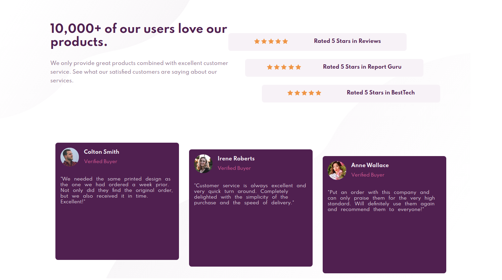

# Frontend Mentor - Social proof section solution

This is a solution to the [Social proof section challenge on Frontend Mentor](https://www.frontendmentor.io/challenges/social-proof-section-6e0qTv_bA).

## Table of contents

- [Overview](#overview)
  - [The challenge](#the-challenge)
  - [Screenshot](#screenshot)
  - [Links](#links)
- [My process](#my-process)
  - [Built with](#built-with)
  - [What I learned](#what-i-learned)
  - [Continued development](#continued-development)
  - [Useful resources](#useful-resources)
- [Author](#author)

## Overview

### The challenge

Users should be able to:

- View the optimal layout for the section depending on their device's screen size

### Screenshot

This is the result in desktop device.

### Links

- Solution URL: [Visit]()
- Live Site URL: [Visit](https://aocelopilli.github.io/FrontendMentor-SocialProof/)

## My process

### Built with

- Semantic HTML5 markup
- CSS custom properties
- Flexbox
- CSS Grid

### What I learned

I practice the way to give styles from JavaScript, in this case the margin thinking about more than 5 items in the future.

### Continued development

Right now I'm practicing Flexbox and Grid, I'd like start to practice some frameworks of CSS like, boopstrap or tailwind and maybe use Sass. 

### Useful resources

- [A Complete Guide to Flexbox](https://css-tricks.com/snippets/css/a-guide-to-flexbox/) - This helped me to understand a kind of things about Flexbox, it is from "css tricks".
- [A Complete Guide to Grid](https://css-tricks.com/snippets/css/complete-guide-grid/) - This helped me to understand a kind of things about CSS Grid, it is from "css tricks".

## Author

+ Website - [angelpineda](https://www.angelpineda.com.mx)
+ Frontend Mentor - [@angelp495](https://www.frontendmentor.io/profile/angelp495)
+ Twitter - [@AOcelopilli](https://twitter.com/AOcelopilli)

